# Predict the price of high-speed-rail network train tickets in Spain.

In this short project, the objective is to predict the ticket price. To do this it is required to download the dataset and build some variables then predict the price. To this objective, I am going to use azure ml to train a lot of different models. Lastly, I will deploy the best model as an endpoint and test if it is working.

## Dataset
The dataset is from Kaggle.: https://www.kaggle.com/thegurusteam/spanish-high-speed-rail-system-ticket-pricing

It is rail ticket pricing. It has multiples variables such as company, origin, destination, departure date, arrival,
duration, vehicle type, vehicle class, and price.
As this dataset is more than 557MB, I will have to create a sample of this data frame. 

### Task

The main objective is to try to predict the price of the ticket. depend on the destination, the day, the day of the week, 
the session.

### Access

Once the dataset is selected, the next thing is to access azure ml studio. 
Then I create computer instances and computer clusters. To have jupyter and cluster where I will deploy the model to train.

I can upload all the jupyter notebooks for this project. there is one important jupyter notebook called: getData.ipynb

In this notebook, getData, I make some preprocess steps for example from departure day 
I extract the day, day of the week, 
type of hours: early morning, afternoon, night.
I delete all the rows without price.
I create a sample from this dataset. Instead of 30.000.000 obs, I will use 5.000 obs

Then we need to upload the dataset.

## Automated ML
### Train
Once the dataset is ready, the next thing is to run de automl jupyter notebook:
In this case, the objective is to predict continue variables, then the problem 
type is regression. 
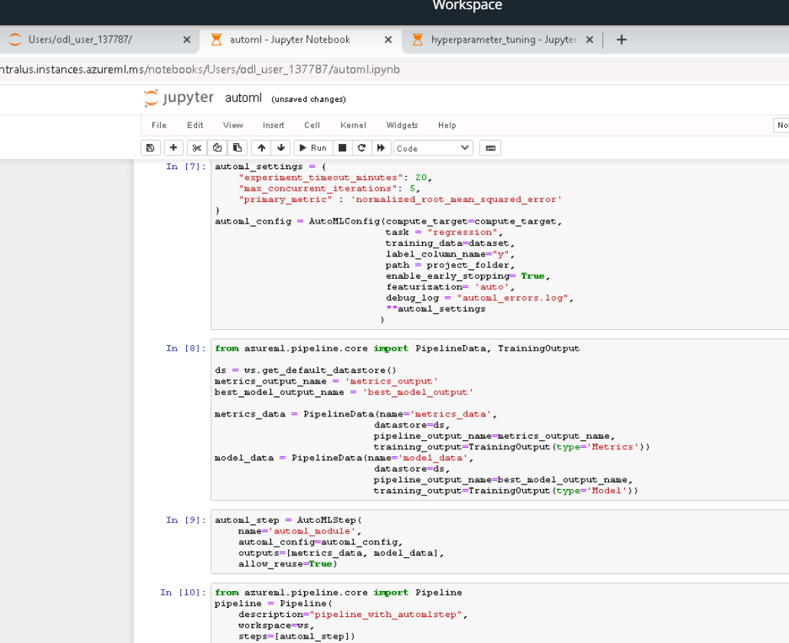
Once the automl pipeline is deployed, the widget show how the different models are being trained. And display the finish message when it ends.
<strong>RunDetails widget</strong>
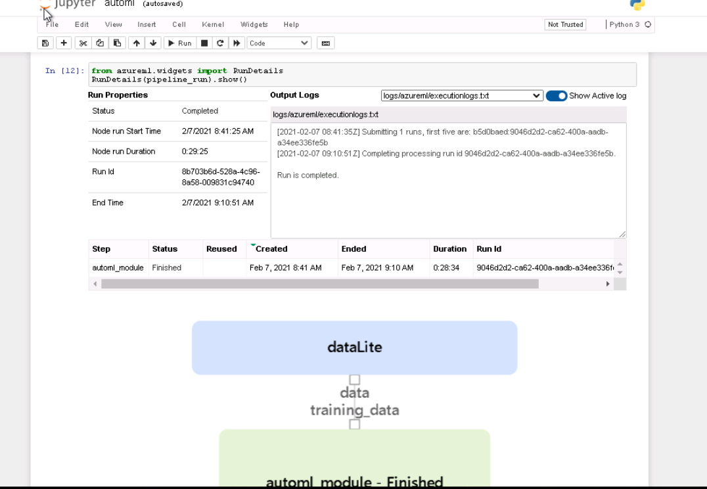
I can see the logs while it is training and when the pipeline has done to train it shows a finish message.
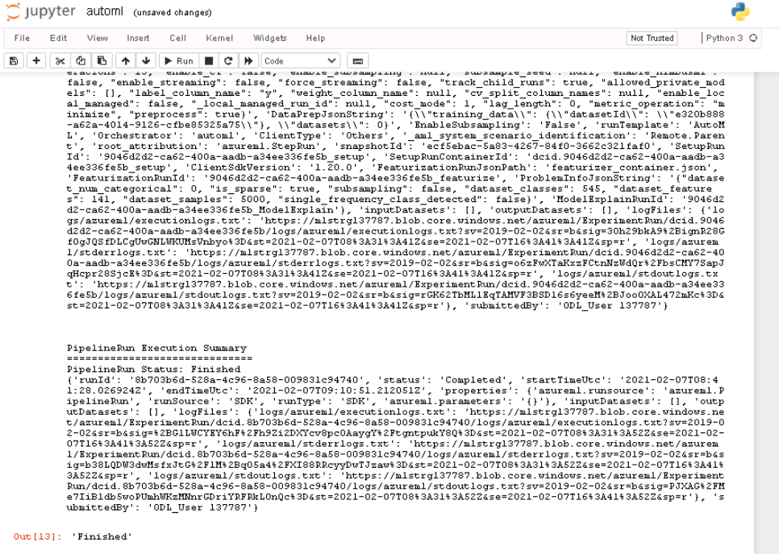
Then, we can see the performance, the metrics of each trained model:
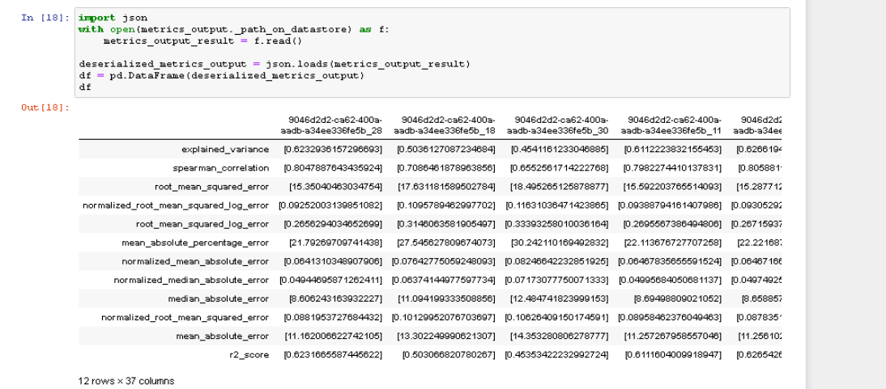
Then select the best model:
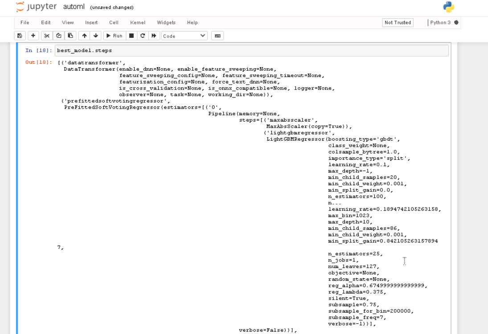
### Publish the automl
Publish the pipeline. 
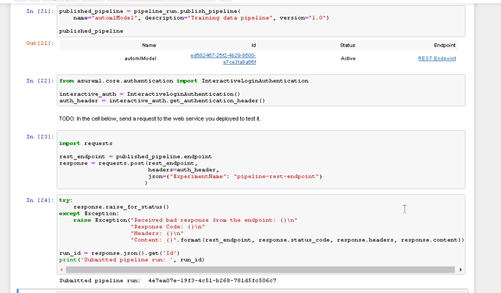
It can be seen as deployed in the azure ml UI
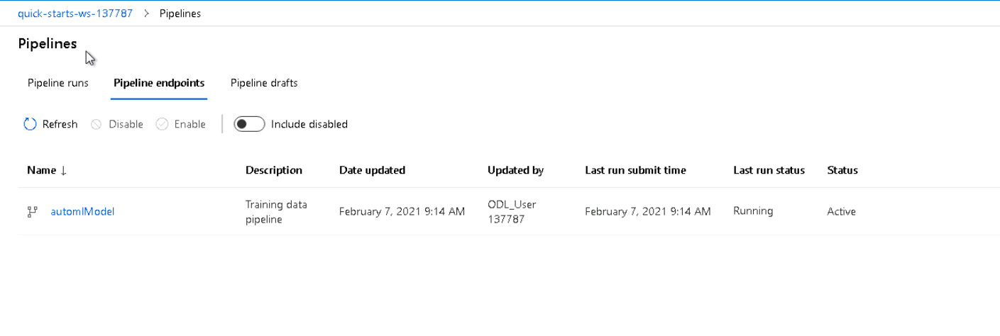
And we can see the best model that in this case is a voting ensemble.
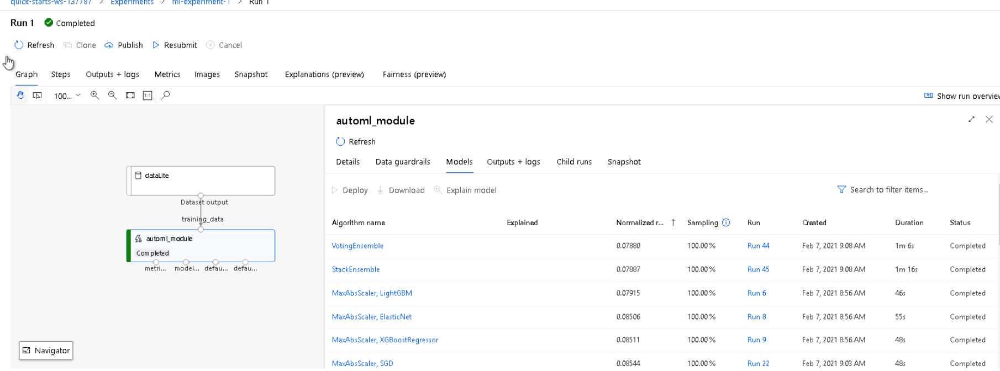
### Logs
We can see the model, logs, explanation to understand better how this model works in our data.
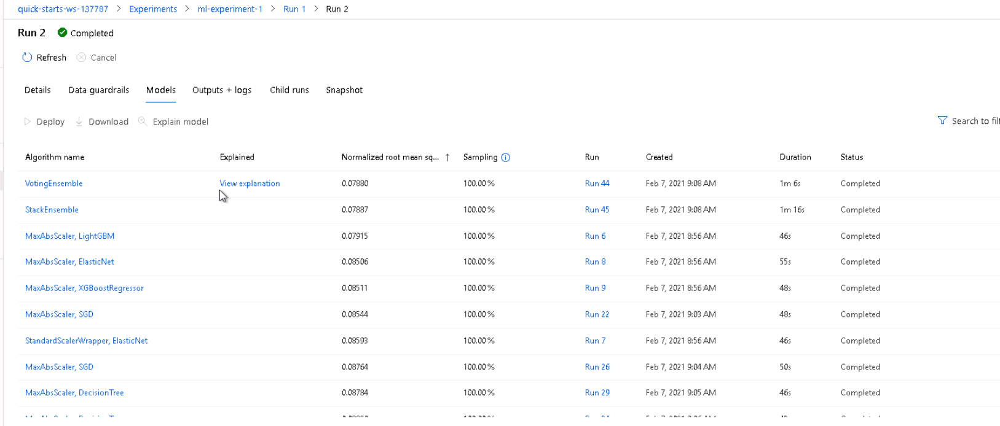
### Deploy best automl model
Then, select the best good model and deployed it to consume it as the rest API endpoint.
I choose a name, azure container instance, and enable authentication.
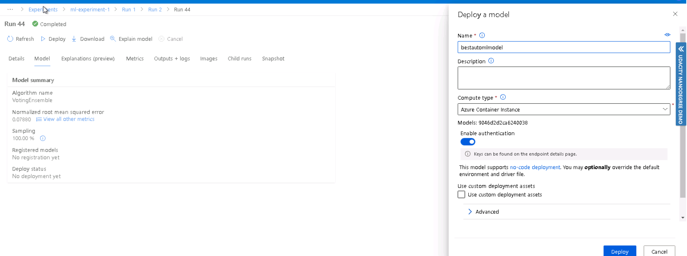
Then the model is deployed
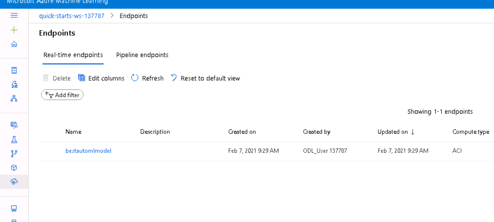
It is healthy and it can be consumed with this example code. where I have an URL
 and keys to interact with this endpoint.
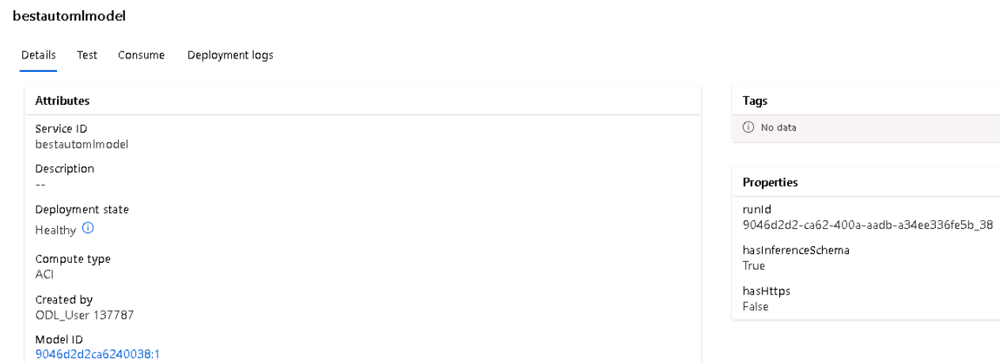
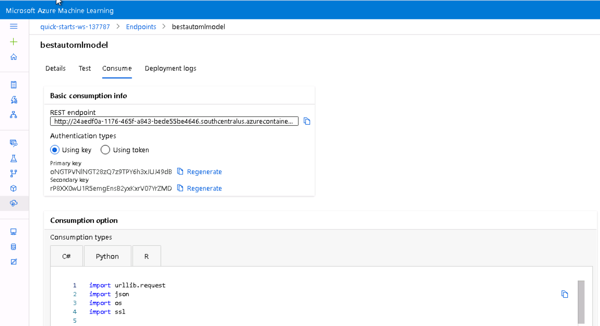
### Results, test endpoint
I can use this code in a Jupiter notebook or interact from another app where I define
 the that that I want to predict, the send this request to the endpoint
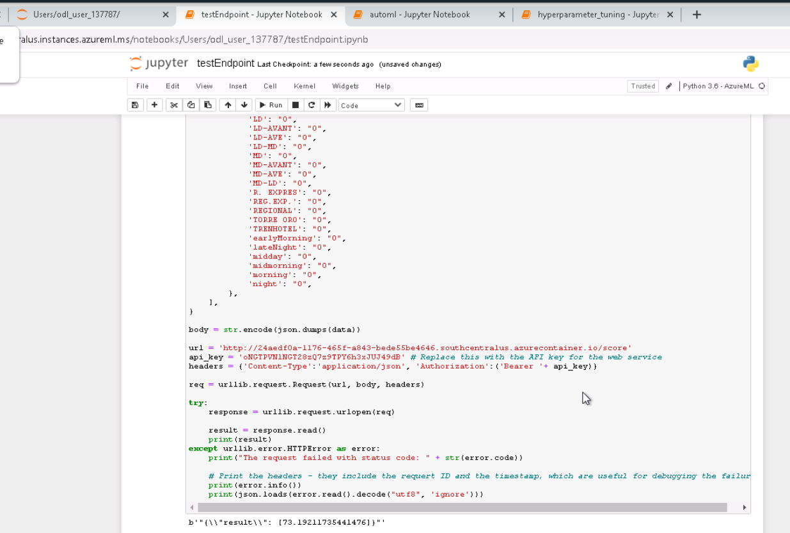

## Hyperparameter Tuning

In this section let find the best hyperparameter to train a regression tree to predict the price. To this propose 
I need:
- the dataset upload
- a training script that it contains all the logic about how to perform the model. that get this hyperparameter as input
- hyperparameter object with parameter sampling to choose and early stoping policy to stop the training process.

This is the script. you can see that it get multiple parameters as input and us them to train the model.
The show in the log the metric

The parameter sampling. in this case, I have chosen only three hyperparameters with 2 or 3 options each. 
I could use other sampling techniques for example random distribution.

then the hyperparameter object is deployed

we can see the logs

To have more details about each model we can see the experiment, in this case, is ml-experiment-hy

Then there are multiple runs, I want to see the last one, the run that is running. Run 7

Inside this run, there are multiples run, each one of these runs is the model each one with a set of hyperparameters.

For examples, inside run 10 we can see the logs and in this case, it required to authenticate 

Once that I authenticate with the code, the runs ends

### Logs
we can see the performance of each model:
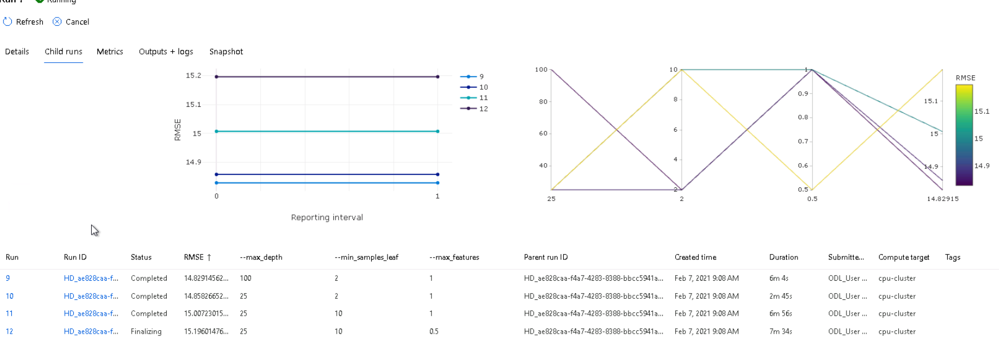
<strong>RunDetails widget</strong>

we can see the logs, the best model, and deployed model

### Deploy the best model
The best model is registred

we can see the model in the UI

we can save it by defining the same of a different workspace, ws.

Then deploy this model as an endpoint as we saw in the automl model.

## Screen Recording
- A working model
- Demo of the deployed  model
- Demo of a sample request sent to the endpoint and its response
https://youtu.be/jmfIApPRld0

