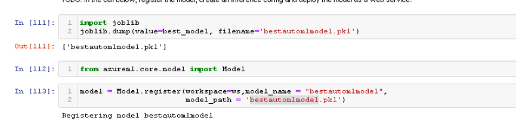
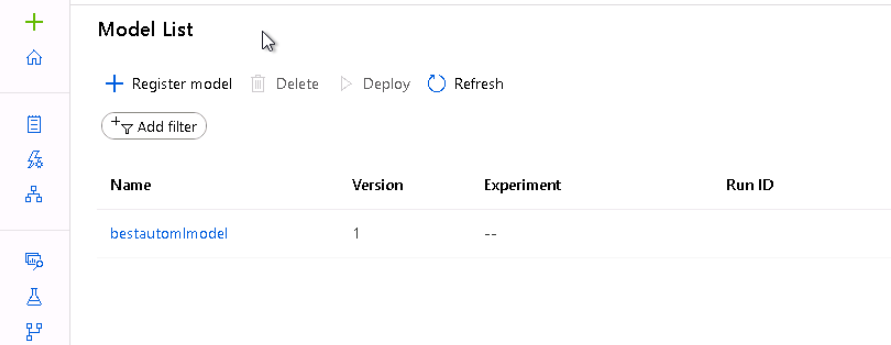

# Predict the price of high-speed-rail network train tickets in Spain.

In this short project, the objective is to predict the ticket price of a train in Spain. multiple variables could be related to the price and It could be great if we could predict the price that we could have depending on the day of the week or other variables. The price is in euros.
 To do this it is required to download the dataset of price ticker from Kaggle and build some variables then predict the price. To this objective, I am going to use azure ml to train a lot of different models. Azure ml is a platform where 
 you can train machine learning models much faster than in your laptops and we can try multiples models at the same time. 
 For this project, I use azure automl and hyperparameter search.
 Azure automl needs a dataset and a target and the azure system will try multiples models to find the best model for your 
 problem.
 Azure hyperdrive, hyperparameter is a much more similar thing to what you would do in your notebook. You define a model 
 with a hyperparameter 
 configuration but when you use this API it random the hyperparameters and tries multiple models in parallel much faster than your laptop.
 Lastly, I will deploy the best model as an endpoint and test if it is working.
 

## Dataset
The dataset is from Kaggle.: https://www.kaggle.com/thegurusteam/spanish-high-speed-rail-system-ticket-pricing

It is rail ticket pricing. It has multiples variables such as company, origin, destination, departure date, arrival,
duration, vehicle type, vehicle class, and price.
As this dataset is more than 557MB, I will have to create a sample of this data frame. 

### Task

The main objective is to try to predict the price of the ticket for trains from Spain. depend on the destination, the 
day, the day of the week, the session.

### Access

Once the dataset is selected, the next thing is to access azure ml studio. 
Then I create computer instances and computer clusters. To have jupyter and cluster where I will deploy the model to train.

I can upload all the jupyter notebooks for this project. there is one important jupyter notebook called: getData.ipynb

In this notebook, getData, I make some preprocess steps for example from departure day 
I extract the day, day of the week, 
type of hours: early morning, afternoon, night.
I delete all the rows without price.
I create a sample from this dataset. Instead of 30.000.000 obs, I will use 5.000 obs

Then we need to upload the dataset.

## Automated ML
### Train
Once the dataset is ready, the next thing is to run de automl jupyter notebook.
Let's take a deeper look at the parameter:

   - Experiment timeout is defined as 20 minutes to save some time. If you load a dataset with a high number of rows it required a longer time. At the beginning of this project when I wanted to predict all the observations I had to 
    increase this number but it took more than one hour of training.
   - The primary metric is a normalized mean square error. This is one of the typical metrics that you can use in a 
    regression problem. The are other metrics but I have chosen this one for convenience.
   - In this case, the objective is to predict continue variables, then the problem type is regression. 
   - The label column is the name of the target column, in this case, y, I have chosen y for convenience but it could have 
other names.
   - The early stopping parameter is defined as true. This parameter has a definition of stoping that allows stopping earlier 
the problem when, for example, after a few multiples iteration the metrics that you want to minimize don't decrease.
   - Debug log is the log where you can see how this automl object is training 
   - Featurization means to do some transformation, feature engineer, that helps to get better prediction. For example 
normalize the data.

Training data is the dataset that I have loaded in memory in a precious cell

Then we can run this automl as a pipeline

The widget shows how the different models are being trained. And display the finish message when it ends.
<strong>RunDetails widget</strong>

We can see the performance of each model. The metric, run time.

The lowest RMSE is 0.0788 as you can see this minimum is reached in the voting ensemble.
These metrics are very low then the model is really good and only has a small error.

we can see that it has l1 ratio=0.32 maxabscaler
We can see the estimator. As I mentioned previously it is a soft voting ensemble, here we can have more details, for example, min child sample is 20, the learning rate is 0.1.

This model ensemble has two steps, first a maxabs scale with a lightgbmregressor and second a maxabs scaler with elasticnet
The output score has a weight of these two models 81 % score is lightgbm model and 18% is electricnet. These are the weights.

We can identify the run id of this best model

### Register the automl model

Then, we can register this best model. It is saved in a pkl called bestaumlmodel

Once it is registered we can see it in the azure UI

### Deploy best automl model by using the code

Once, it is registered we can deploy this model as an endpoint

We need to define the service, the aci config, the conda environment and download the best model.
The name of this endpoint is <strong>aml</strong>

The aciwebserive is a very important object because it is how the endpoint is defined, its configuration. I have chose
1 CPU and 1 GB. It is not the most efficient and maybe I could reduce this size to reduce the cost. 
The default values are 0.1 CPU and 0.5 GB. As you can see in the Azure documentation: https://docs.microsoft.com/en-us/python/api/azureml-core/azureml.core.webservice.aci.aciservicedeploymentconfiguration?view=azure-ml-py
the cpu_core is "the number of cores to allocate this webservice" and memory_gb is "the amount of memory to allocate this webservice"

As this model is very simple and we don't need too much data in memory maybe we could set 0.100 GB or less to this webservice

The score script is this:

In this script the endpoint read the model, bestautomlmodel.pkl, the, read the data and, make a prediction of 
the data with the loaded model 

Then, we are ready to deploy this endpoint:

And now we can see the depoyed endpoint with code called <strong> aml </strong> 

We can see that this endpoint is healthy and the URL. 

### Deploy best automl model by using the UI

This is how to deploy from code but we can deploy it by using the UI.

First, we need to find the best model in the UI, it is a voting ensemble, the same that we have deployed previously but now 
we are going to deploy it using this UI.

Second, select this run and deploy it

It can be seen as deployed in the azure ml UI and it is healthy too.

Now, we can see that there are other called automlui that was created with the UI

### Results, test endpoint

The endpoint is ready to be tested. (This is the endpoint deployed by using code)

I have created a jupyter notebook to test this endpoint, In this code, there are two parts:

(NEW, I have added this <strong>inference request</strong> to the automl notebook too)
- the data with all the variables that take one value each one. it just a test example but we could read it from a CSV 
and ask multiple times to this endpoint.

 

- The headers where the URL endpoint is defined with the key

This HTTP request will send the data to the endpoint (this inference code) and read the response of this endpoint. 
Then the endpoint (the score script) recibe the data, load the model a make a prediction. This prediction is sent back to the first machine
This response is the predicted price of a ticket with these characteristics. In this case: 73.19 euros.

we can see that this HTTP is received because we can be the logs and it received a post-petition at 9:49 the same hour that
 you can see in the previous script that show the time afte4 retrieve the requests
 

We can see the traffic of the endpoint and we see that we are receiving petitions, blue chart.

### save environment

To make this process more replicated I download the environment with 

And this environment is loaded to be replicable. 

This code generates 2 files:

## Hyperparameter Tuning

In this section let find the best hyperparameter to train a regression tree to predict the price. To this propose 
I need:
- the dataset upload
- a training script that it contains all the logic about how to perform the model. that get this hyperparameter as input
- hyperparameter object with parameter sampling to choose and early stoping policy to stop the training process.

This is the script. you can see that it get multiple parameters as input and us them to train the model.
The model will show the score in the log.

We can have a deeper look at this parameter:
- Max depth is how deep is are the trees. 
- Each tree is going to split into two leaves each one is going to have another split and so on. to define the minimum size
 of each leaf before a split, we use min samples per leaf 
- The difference between a random forest and a decision tree is that a random forest runs a lot of different decision trees and mixes all the models in just one. each decision tree doesn't use the same columns, features each one randomly several features. For example, the first one uses the destination and day of the week and the second one uses the week of the day and the duration. This maximum number of features randomized is defined by the hyperparameter called max features
 

The parameter sampling. in this case, I have chosen only three hyperparameters with 2 or 3 options each. 
I could use other sampling techniques for example random distribution.

Then the hyperparameter object is deployed. But before it, we need to define the estimator that is built as a sklearn object and the script where all the train logic was defined.
 the primary metric is rmse is the name that I used in the training script to save the metric root mean square error.
The primary metric goal is to minimize because as low the RMSE is best is the model.
max total runs=4 it is an experiment and in 3 hours we can try 100 models, we need to have a restricted number of models to save time. even, there are only 6 hyperparameters model combination to train. 4 of these 12 is 33% of these combinations

we can see the logs

To have more details about each model we can see the experiment, in this case, is ml-experiment-hy

Then there are multiple runs, I want to see the last one, the run that is running. Run 7

Inside this run, there are multiples run, each one of these runs is the model each one with a set of hyperparameters.

For examples, inside run 10 we can see the logs and in this case, it required to authenticate 

Once that I authenticate with the code, the runs ends

### Logs

we can see the performance of each model:

For example, when the max depth is 100 min samples is 2 and max features the models get an RMSE of 14.89 with is not bad, 
it is lower than the default rmse that I could get in a random forest without specifying the hyperparameters

<strong>RunDetails widget</strong>

we can see the logs, the best model, and deployed model

### Deploy the best model

The best model is registred

we can see the model in the UI

we can save it by defining the same of a different workspace, ws.

Then deploy this model as an endpoint as we saw in the automl model.

## Screen Recording

- A working model
- Demo of the deployed  model
- Demo of a sample request sent to the endpoint and its response

https://youtu.be/jmfIApPRld0

## Suggestions For Future Improvement

- one thing that could improve the model is to have more hyperparameter, add a longer grid.

- Another thing could be to use more data. AS I mentioned I had to do a sample of this data but we have 29.950.000 extra rows 
that could help to understand more complex behavior.

- It had developed a get data step where I build some feature engineering that I know about the problem because I have previous 
knowledge about the ticket price and I know that It depends on the month of the year and sometimes on the day of the week 
but The model could improve if we add more feature engineering variables for examples the how much time before the 
departure the ticket was sold if there was an important event at that time when was the spring break of that year...
 

