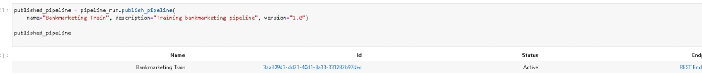
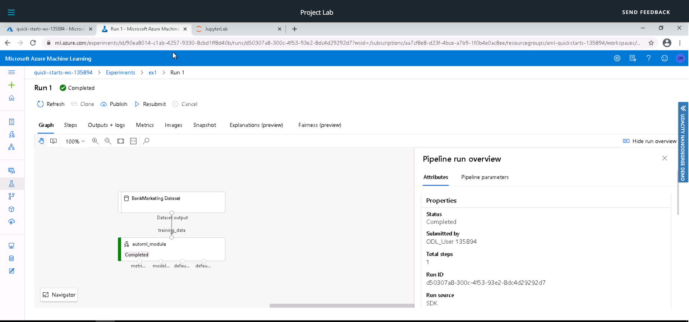

# An overview of the project
In this project, the main objective is to deploy machine learning models in azure. To do this there are a few things 
that are required to do:
- Get permission
- Connect to azure ML platform
- Create a computer cluster
- Load dataset
- Configure Automl
- Train a model in automl
- Deploy model in a rest API from ML studio platform
- check logs
- show swagger
- Consume model from azure Python SDK
- Benchmark endpoint
- train and deploy rest API from ML Azure Python SDK

# An architectural diagram
The structure of this project can be shown as this diagram:
Each box is a step in the project and each box has multiples tasks to do to be completed.

# A short description of how to improve the project in the future
To improve this project a few things must be made:
- Understand the data. this means to do EDA to understand the models. Azure automl is looking for multiple models,
 multiples hyperparameters of each model and some preprocess steps but it is known that the vast majority of the job of a data scientist is feature engineer. An EDA should help to get a better comprehension of this problem to be able to 
 build new variables, then get better predictions(more than 91% accuracy)
 
- This model uses the only accuracy but maybe the problem requires giving more weight to one of the classes. In that case an
 F beta score should be a better option.
 
- Train deep learning models. In this case, I uncheck deep learning models, the reason why is because 3 hours, 
the time that I have available the Udacity lab, is not enough time to train too many models so I decided to skip deep learning models that should take a longer time. Deep learning models can be more complicated to explain to people with fewer analytics skills than another model such as random forest but It can take a very high accuracy.

- In this project, I learn how to deploy ml model in azure and consume it form an entrypoint and jupyter notebook but It 
could be grateful to use it in an app for example a Django, dash Streamlit app, or a simple HTML website.

- Another important point could be to deploy the model in a docker microservice and deploy this model with azure
 Kubernetes stances, the reason why to add this section is that it would teach how to deploy our own docker

# All the screenshot required in the project main steps with a short description 
In this section, you can see the step by step entire project. The project was made in two days and I had to repeat it from the beginning but I skip to upload repeated pictures.
<h3>Step 1: Authentication</h3>
First, let's try to authenticate. 
There is a problem to do the first part of this project. Udacity student count has the role of the reader and it is 
required to have advance authorization to do this step. 

 But, It is not a problem because the udacity lab y configure to skip this step
<h3> Step 2: Automated ML Experiment</h3>
The next thing is to train a model.
<h4> Create compute cluster</h4>
First, we need to create a computer cluster. This is a VM where all the code is going to be run.

<h4> Automated ML Experiment </h4>
Now, we are ready to train a model by using the azure ml studio UI
<h5>Dataset</h5>
We load the dataset:

<h5> Automl configuration</h5>
Then configure the azure automl run, select the computer cluster previously created

Explain the model, classification

<h5> Model experiment complited</h5>
Once the experiment has been completed is the status section appear stratus="Compleated
At the right, we can see that the best model is a voting ensemble

    
<h3> Step 3: Deploy the Best Model </h3>
The next thing is to deploy the model using the azure ml studio UI
<h4> Deploy the Best Model</h4>
<h5>Select best model</h5>
We can see in more detail the models trained in this run. This table is ordered by accuracy and the best
 model is a voting ensemble.

<h5>Deploy configuration enable authentication and ACI</h5>

This model is chosen 

<h5> Deploy</h5>

This model is deployed and it can be consumed a rest API

    
<h3>Step 4: Enable Application Insights</h3>
As you can see in the authentification section where I had an issue with my user authorization I was using a git-shell. 
AZ is already installed in the system and the python version is greater than 3.8. 
The next thing is to Application Insights enabled says “true”.
To do this I run this chunk of code. It is part of the code that you will see in a later picture

<h4> Logs </h4>
Once the log is available by azure python SDK we can see the logs
This code comes from logs.py but I have copied it on a jupyter notebook to make it easier to use all the code.

<h3>Step 5: Swagger Documentation</h3>
Now, That we know that the apr rest is running, log looks create the next thing is to show to swagger 
documentation of this endpoint
<h4> Swagger </h4>
Previously I had to download the JSON file from azure ml studio, run a docker container of swagger and run server.py to 
see the JSON document in the required port.

<h3>Step 6: Consume Model Endpoints</h3>
Now, we can consume the endpoint
<h4> Consume Model Endpoints</h4>

<h5> Endpoint</h5>
The code to predict now data from the scrip called endpoint.py

The data is saved in a JSON called data.json

And the result is "no"
We can see the same result by running the script from the shell

<h5> Benchmark</h5>

Now, we know that the API rest returns a prediction of this model but we need to measure the performance of this endpoint. is it fast? does it have a lot of issues?
To do this we run ab library

<h3>Step 7: Create, Publish and Consume a Pipeline</h3>
Lastly. let's deploy a pipeline from a jupyter notebook I use python SDK to train and deploy ml models
The model is trained with azure automl  
It is running

You can see that it is running in the UI

In the notebook, you can see that the automl is running

Once it has done the pipeline is active and ready to be used

Now, the pipeline has been published showing a REST endpoint and a status of Compleated

# A link to the screencast video on youtube.
In the next link, you can see a demo of this project: 
 
First part https://youtu.be/lkBe-09wGPE

Audio transcription:
- 0:13 I need to have some extra time for my lab
- 0:22 Now, I can come back to the lab
- 0:24 I show you the uploaded dataset.
- 0:27 Is this dataset
- 0:32 Next, I show the automl ml model that I have trained.
- 0:34 It is this one. 
- 0:35 It has been completed in 1h and 22 minutes.
- 0:40 let's explore this automl run
- 0:42 It's status is completed. 
- 0:42 It gets 91.83 accuracy
- 0:47 the best model is a voting ensemble
- 0:51 let's see the configuration of this run
- 0:54 accuracy as the primary metric, without deep learning models to save time. 
  On hour train time and 3 max concurrent iterations (previously, I had created a VM with 4 cores)
- 1:05 let's see the models
- 1:06 this is the voting ensemble, the model that I have deployed.
- 1:10 we can see the endpoint
- 1:13 this is the endpoint
- 1:16 let's see the configuration of this endpoint
- 1:19 this is the rest endpoint that I need for de endpoint script, is the URL where the model is hosted, where I will send an HTTP request
- 1:22 this is the swagger URI. It is the JSON that I have upload to the swagger docker to see the documentation of the API of this deployed model.
- 1:31 let's check the logs of this endpoint. To do this I have copied and past logs.py in this jupyter notebook.
- 1:34 this is the same code that you can see in the logs.py and you can see that I have to change the name of the deployed 
- 1:36 it is the same name because I want to see the logs of this deployed model
- 1:40 I am sorry this is not the notebook
- 1:41 this is the notebook
- 1:44 when I click run we can see the output logs
- 1:52 The next thing is to predict data, use the endpoint. I have copied to code from endpoint.py and pasted it in this notebook.
- 1:56 but first look at the swagger. It is very friendly documentation of this endpoint.
- 2:00 we can see that this swagger is associated with my endpoint because at the top of this documentation you can see deploy-model as the title. the same name of the deployed run.
- 2:12 I am looking for the scripts that I had to modify to create this swagger documentation. 
- 2:15 I have downloaded the JSON
- 2:16 let's see the script. int his notebook the .json provided is going to be deployed in port 8000 to be visible to the swagger docker
- 2:21 but this is the important file, the .sh 
- 2:24 in this .sh the swagger docker in the run-in port 9811 and refer to the internal port 8000 to communicate the information from the previous swagger.py that I saw you before.
- 2:28 a this is the swagger.json
- 2:34 As I have mentioned port 9011 in the .sh 
- 2:37 localhost port 9011 in my browser
- 2:39 the docker shows this information
- 2:45 we can see the documentation, the healthy response, how to curl request is build
- 2:50 how to data input should look like
- 2:54 we can click run and execute 
- 3:27 let's come back to the notebook
- 3:29 this is new data that I am going to predict. All this code come from the endpoint.py script
- 3:32 this is the data
- 3:35 I click run
- 3:36 and the output results "no"
- 3:39 we can see that that input data have been saved in a JSON to be readable form the API rest
- 3:40 this is the data.json
- 3:45 next, let's run a benchmark of this endpoint. To do this we need to open a terminal.
- 3:55 this is the terminal
- 4:18 I am going to open a previous terminal session
- 4:21 terminal 2 is the terminal that I have used previously 
- 4:30 and I run the command to benchmark this endpoint with the library called ab.
- 4:32 The benchmark is running
- 4:33 this is the performance 
- 4:41 the information size is 240 bytes
- 4:43 0 errors from 10 request
- 4:47 the time was 1.20 seconds, it is very fast.
- 4:52 more information about the performance if we want more details 
- 4:56 then let's see the deploy pipeline notebook
- 5:00 It is running right now
- 5:11  I have run all the cells, I have to change the compute cluster and experiment name
- 5:14 and we can see the intermediate output of the training of the automl
- 5:27 lastly let's see the pipeline in the UI and how it is running
- 5:33 this is the pipeline
- 5:35 it is running
- 5:36 let's see the run
- 5:38 in this graph we can see that this is a very simple pipeline take the data and automl model
- 5:39 this is the end of this video. Goodbye!

Second part:
https://youtu.be/4q-SrR83r4s

Audio transcription:
- 0:02 when the jupyter notebook has done to run 
- 0:06 as you can see It has been completed
- 0:18 there are different metric each one calculated to each model
- 0:29 the best model is selected and used to predict data. The confuse matrix has very high accuracy
- 0:34 the pipeline has been published
- 0:40 and in the Azure ml studio you can see that now the pipeline has been completed

Deployed Pipeline
